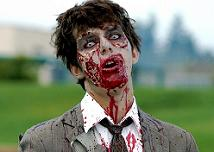

Zombie es un término de la lengua inglesa que, en nuestro idioma, se traduce como zombi. Se trata de un cadáver que, a través de algún tipo hechizo, ha sido reanimado. Un zombi, por lo tanto, es un muerto viviente. Aunque el concepto puede emplearse con múltiples matices, por lo general se usa con referencia al fallecido que fue resucitado mediante un elemento mágico y que obedece las órdenes de aquel que lo resucitó. Esta acepción es habitual en el vudú: quienes profesan esta religión creen que un bokor (una especie de sacerdote que realiza magia negra) puede realizar un ritual para revivir a un individuo muerto y convertirlo en su esclavo.

Puede decirse que un zombi es una criatura sin conciencia ni autodeterminación, que solo cumple órdenes o que actúa por impulso. Las representaciones más comunes muestran a los zombis como seres de nula inteligencia, aunque de gran fuerza física.

Es frecuente que se presente a los zombis como caníbales: cuando muerden a una persona (viva), ésta también se convierte en zombi. En cuanto al aspecto de los zombis, suelen tener la piel muy pálida o verdosa, que incluso se cae en distintas capas, como si estuviese podrida.

